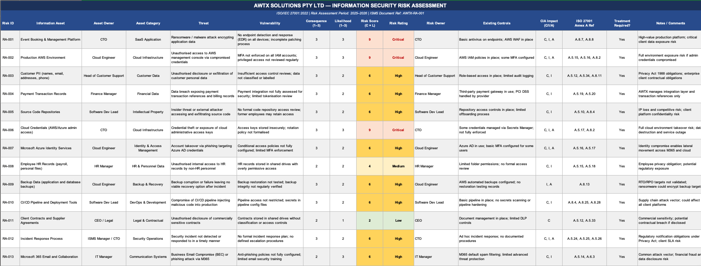
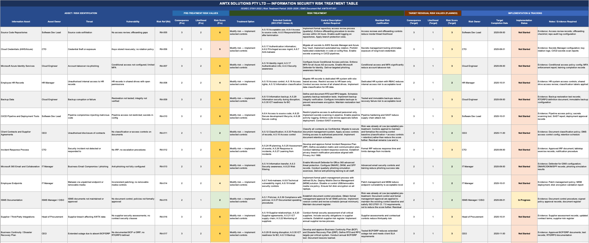
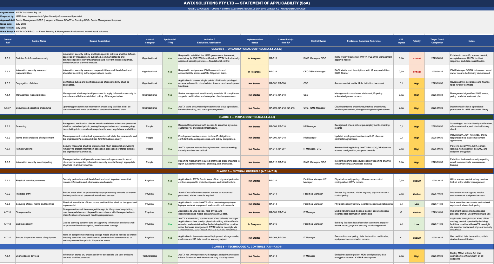
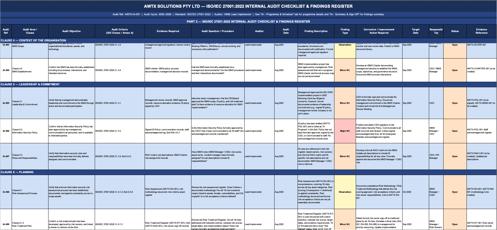
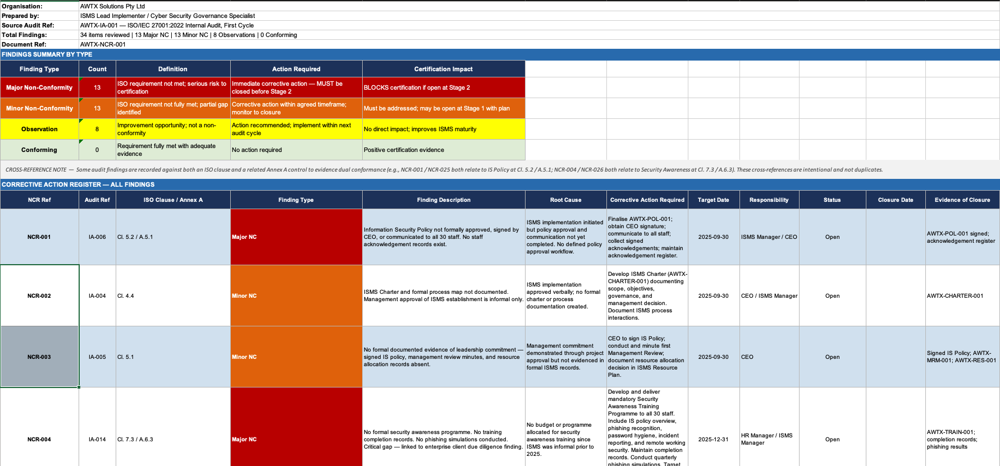
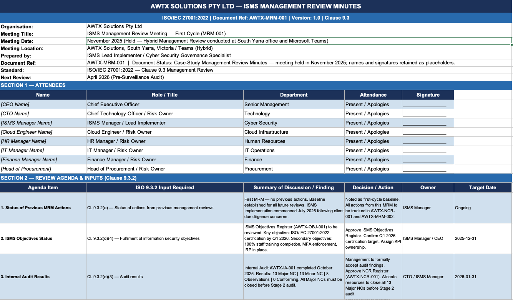

# 🏛️ Governance & GRC Labs

**SCGLabs — Security, Cloud & Governance Labs**

A professional GRC portfolio repository demonstrating hands-on capability in ISO/IEC 27001:2022 implementation, risk management, internal audit, corrective action management, and management review documentation.

---

## 📁 Repository Contents

```
governance-grc-labs/
├── README.md
└── awtx-isms-portfolio/
    ├── docs/
    │   └── AWTX-ISO27001-Lead-Implementer-Portfolio.pdf
    └── screenshots/
        ├── risk-assessment-preview.png
        ├── risk-treatment-preview.png
        ├── statement-of-applicability-preview.png
        ├── internal-audit-preview.png
        ├── corrective-action-register-preview.png
        └── management-review-preview.png
```

---

## 📄 View Full Portfolio Report

The complete ISO/IEC 27001:2022 Lead Implementer Portfolio is available as a structured PDF report covering all seven ISMS implementation scenarios, a tab-by-tab workbook walkthrough, a demonstrated competencies matrix, and full references.

> **[📄 View Full Portfolio Report — AWTX Solutions ISO/IEC 27001:2022 Lead Implementer Portfolio](awtx-isms-portfolio/docs/AWTX-ISO27001-Lead-Implementer-Portfolio.pdf)**

---

## 🏢 Project — AWTX Solutions Pty Ltd

### ISO/IEC 27001:2022 ISMS Lead Implementer Portfolio

This project is a realistic simulated case study based on an Australian SME SaaS operating environment. It demonstrates an end-to-end ISO/IEC 27001:2022 ISMS implementation for a 30-person organisation using AWS, Azure, Microsoft 365, and third-party payment services.

**Document Reference:** ZY-PORT-001 v1.0 · **Date:** November 2025 · **Prepared by:** Zain Younas

---

### Project Summary

| Area | Detail |
|---|---|
| **Organisation** | AWTX Solutions Pty Ltd — Melbourne-based SaaS SME (~30 employees) |
| **Trigger** | Enterprise client due-diligence review exposing material governance gaps |
| **Mandate** | End-to-end ISO/IEC 27001:2022 ISMS implementation through to certification readiness |
| **Cloud Environment** | AWS (production), Microsoft Azure / Entra ID, Microsoft 365 |
| **Standards Applied** | ISO/IEC 27001:2022 · ISO/IEC 27005:2022 · ASD Essential Eight · Privacy Act 1988 (Cth) |
| **Certification Target** | Stage 1 — February 2026 · Stage 2 — March 2026 |

**ISMS Scope** — All organisational departments, the South Yarra office and authorised remote locations, the Event Booking and Management Platform, supporting AWS and Azure infrastructure, Microsoft 365, and material third-party suppliers including payment gateways.

**Methodology** — Plan–Do–Check–Act (PDCA) across six delivery phases: Foundation & Governance → Risk Assessment & Treatment → Control Implementation → Internal Audit & Review → Certification Preparation → Stage 2 Audit.

**Artefacts Produced:**

- `AWTX-SCOPE-001` — ISMS Scope Document (Cl. 4.3)
- `AWTX-RM-001` — Risk Methodology
- `AWTX-RA-001` — Risk Register (18 risks across 6 asset categories)
- `AWTX-RT-001` — Risk Treatment Plan
- `AWTX-SOA-001` — Statement of Applicability (all 93 Annex A controls)
- `AWTX-ROAD-001` — ISMS Implementation Roadmap (40 deliverables)
- `AWTX-IA-001` — Internal Audit Programme, Checklist & Sign-Off
- `AWTX-NCR-001` — Corrective Action Register
- `AWTX-MRM-001` — Management Review Minutes

---

## 📊 Portfolio Evidence

The sections below present each major workbook area with inline screenshots and a summary of what each section demonstrates. The full editable workbook and working templates are not published publicly — evidence is presented through the PDF portfolio report and selected screenshots.

---

### A — Risk Assessment

The risk assessment was designed using a 3×3 qualitative matrix aligned with ISO/IEC 27005:2022, producing 18 registered risks across six information asset categories. Each risk was scored independently for Consequence and Likelihood, mapped to specific ISO/IEC 27001:2022 Annex A controls, and categorised as Critical, High, Medium, or Low.

Three Critical risks were identified: ransomware exposure against the Event Booking Platform (RA-001), unauthorised admin-console access to the production AWS environment (RA-002), and credential theft or exposure across AWS and Azure (RA-006), each scoring 3×3=9.



**What this demonstrates:**
- Structured risk identification across people, process, and technology domains
- ISO/IEC 27005:2022-aligned qualitative risk-rating methodology
- Asset-threat-vulnerability decomposition with CIA impact mapping
- Risk-to-Annex-A control traceability from the ground up

---

### B — Risk Treatment Plan

For each of the 18 registered risks, a treatment option was selected — Modify, Transfer, Avoid, or Accept — along with specific Annex A controls, required actions, ownership, target completion dates, and a residual-risk justification narrative. All 18 risks were assigned the Modify option, as every in-scope activity was essential to the business.

The treatment plan targets a residual risk profile of 0 Critical, 0 High, 11 Medium, and 7 Low risks once all selected controls are fully implemented and verified.



**What this demonstrates:**
- Risk treatment option evaluation against real business constraints
- Pre-treatment vs target residual risk scoring with written justification
- Control-to-risk traceability linking treatment actions to Annex A references
- Honest treatment of consequence as largely fixed where data sensitivity cannot be reduced

---

### C — Statement of Applicability

All 93 ISO/IEC 27001:2022 Annex A controls were assessed, with applicability decisions, inclusion justifications, implementation status, control ownership, linked risk identifiers, evidence references, and target dates recorded for each control. No controls were excluded — including the 11 controls newly introduced in the 2022 revision of the standard.

The SoA is the primary artefact used by certification auditors during Stage 1 document review. Its internal consistency with the Risk Register and Risk Treatment Plan is the strongest indicator of ISMS maturity.



**What this demonstrates:**
- Full coverage of all 93 Annex A controls across four 2022 themes — Organisational, People, Physical, Technological
- Individual assessment of all 11 new 2022 controls, including A.5.23 (Cloud Services), A.8.12 (Data Leakage Prevention), and A.6.7 (Remote Working)
- Risk-driven control selection with RA-ID linkage per control row
- Implementation status and control owner accountability per row

---

### D — Internal Audit

A four-phase internal audit programme was conducted across ISO/IEC 27001:2022 Clauses 4–10 and all priority Annex A controls between August and October 2025. A 34-item checklist was applied, with each item recording a specific audit question, evidence required, finding, finding type, and corrective action.

To satisfy the Clause 9.2 independence requirement, an external Audit Advisor independently reviewed the audit programme and sampled execution evidence. The first-cycle audit yielded 13 Major non-conformities, 13 Minor non-conformities, and 8 observations — results consistent with an implementation-phase audit before all controls reach steady-state operation.



**What this demonstrates:**
- Structured internal audit programme aligned to Clause 9.2 requirements
- Four-phase audit coverage sequenced to mirror certification body methodology
- Evidence-based audit questioning rather than checkbox assessments
- Finding classification using Major NC, Minor NC, Observation, and Conforming categories

---

### E — Corrective Action Register

All 34 internal audit outcomes were captured in a Corrective Action Register, comprising 13 Major NCs, 13 Minor NCs, and 8 Observations. Each record includes the source audit reference, ISO clause or Annex A reference, root cause analysis for Major NCs, corrective action required, responsible owner, target date, closure status, and evidence of closure.

A worked example — NCR-006 — addresses the MFA enforcement gap across AWS IAM, Azure Entra ID, and Microsoft 365. The corrective action extended beyond the technical fix to include Access Control Policy approval, ownership assignment, and a quarterly access-review schedule, addressing both the symptom and the systemic cause as required by Clause 10.2(b).



**What this demonstrates:**
- Root-cause analysis discipline on all Major non-conformities
- Structured corrective action tracking from finding through to evidence-based closure
- Cross-referencing of NCR records back to SoA Annex A control rows
- Clear separation of Major NCs, Minor NCs, and Observations within the same register

---

### F — Management Review

The inaugural ISMS Management Review was convened in November 2025, chaired by the CEO, with the senior management team attending hybrid across the South Yarra office and Microsoft Teams. All mandatory Clause 9.3.2 inputs were addressed, and 10 documented management actions were raised with named owners and target dates.

The review formally captured management decisions required to progress toward certification readiness, including CEO sign-off of key ISMS documents, resource approval for priority tooling, weekly tracking of the three Critical risks, and a Stage 1 readiness dry run scheduled for January 2026.



**What this demonstrates:**
- Management review structure aligned exactly to Clause 9.3.2 mandatory inputs
- All 10 management actions recorded as MRM-ACT references with owners and dates
- Governance of the ISMS at the executive level with CEO chair and formal sign-off
- Closing the PDCA cycle — outputs feeding back into the roadmap and corrective action register

---

## 🛠️ Skills Demonstrated

| Domain | Capability |
|---|---|
| **ISO/IEC 27001:2022** | End-to-end ISMS implementation across all Clauses 4–10 and Annex A |
| **Risk Assessment** | ISO/IEC 27005:2022-aligned qualitative risk assessment, 3×3 matrix, 18 risks across 6 asset categories |
| **Risk Treatment** | Treatment option evaluation, residual risk justification, control-to-risk traceability |
| **Statement of Applicability** | Full 93-control SoA with applicability decisions, risk linkage, and ownership |
| **Internal Audit** | Four-phase Clause 9.2 programme, evidence-based findings, independence management |
| **Corrective Actions** | Root-cause analysis, structured NCR tracking, evidence-based closure (Clause 10.2) |
| **Management Review** | Clause 9.3 inputs and outputs, management action tracking, executive engagement |
| **Compliance Documentation** | ISMS artefact suite from scope through to management review minutes |
| **ASD Essential Eight** | Awareness and contextual alignment within the Australian regulatory landscape |
| **Privacy Act 1988 (Cth)** | Regulatory context applied throughout the ISMS scope and management review |
| **Cloud Security Governance** | AWS, Microsoft Azure, Entra ID, and Microsoft 365 within an ISMS scope |

---

## 🔒 Public Evidence Note

The full editable Excel workbook and working ISMS templates are not published publicly. Portfolio evidence is presented through the structured PDF report and selected screenshots displayed above.

This approach reflects professional practice — demonstrating methodology, decision-making, and documentation quality without exposing working templates as uncontrolled public artefacts.

The PDF portfolio report is the primary evidence document and is available via the link at the top of this page.

---

## ⚠️ Disclaimer

AWTX Solutions Pty Ltd is a simulated case-study organisation based on a realistic Australian SME operating structure. This project was created for portfolio demonstration purposes. No real organisational data, credentials, client information, or production systems are used.

---

*SCGLabs · Melbourne, AU · [github.com/SCGLabs](https://github.com/SCGLabs)*
